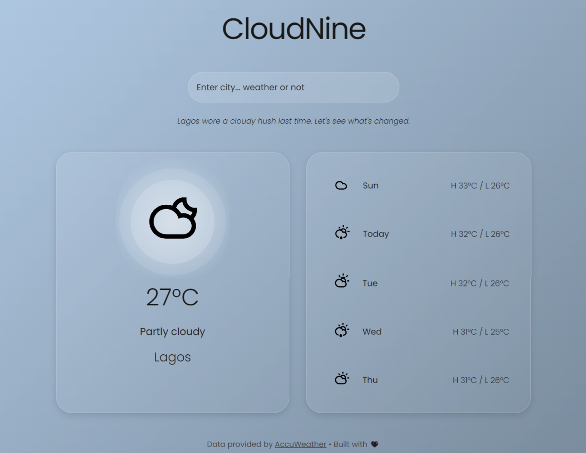

# ☁️ CloudNine

**Weather or not, we've got you covered.**

CloudNine is a polished, interactive weather app that taps into the AccuWeather API to deliver real-time forecasts wrapped in smooth animations and a responsive design.

## 📸 Screenshot



## ✨ Features

- Real-time weather and 5-day forecast via AccuWeather
- Responsive design with smooth UI transitions
- Weather-based background updates
- Express backend with secure API integration
- Local caching for faster refreshes

## 🔧 Setup

To run CloudNine locally:

### 1. Clone the repository

```bash
git clone https://github.com/paulspective/cloudnine.git
cd cloudnine
```

### 2. Install dependencies

```bash
cd app
npm install
```

### 3. Set up environment

Create a `.env` file and add your AccuWeather API key:

```env
ACCUWEATHER_KEY=your_actual_api_key
```

### 4. Start the server 

```bash
npm run dev
```
Open your browser at `http:localhost:PORT` (default 3000).

## 🧠 Architecture

```
cloudnine/
├── app/
│   ├── .env
│   ├── server.js
│   └── weather_service.js
├── public/
│       ├── index.html
│       ├── style.css
│       ├── manifest.json
│       ├── service-worker.js
│       ├── favicons/
│       ├── font/
│       ├── icons/
│       └── scripts/
│           ├── api.js
│           ├── ui.js
│           └── main.js
├── assets/
│   └── cloudnine-screenshot.png
├── .gitignore
├── CHANGELOG.md
└── README.md
```

## 🧰 Tech Stack
- Frontend: HTML, CSS, JavaScript (Vanilla)
- Backend: Node.js, Express
- API: AccuWeather
- Tools: Git, Live Server, npm


## ❤️ Credits

Uses data from AccuWeather API 

Built with love, logic, and a little shimmer. ✨

See [Changelog](CHANGELOG.md) for a detailed version history.