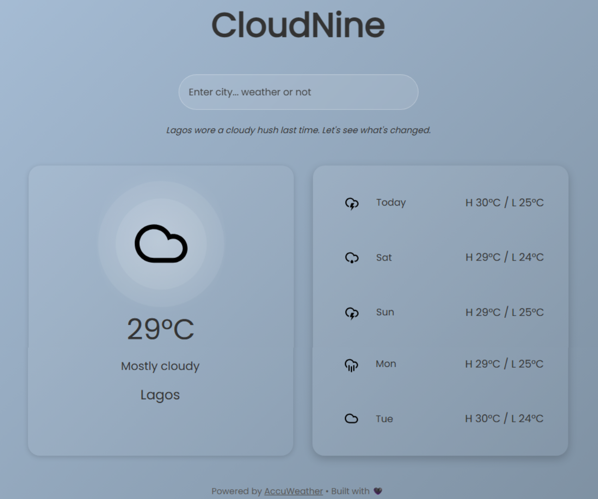

# ☁️ CloudNine

**Weather or not, we've got you covered.**

CloudNine is a responsive weather app that displays current conditions and a five-day forecast using AccuWeather data.

## 📸 Screenshot



## ✨ Features

- Real-time weather and 5-day forecast via AccuWeather
- Responsive design with smooth UI transitions
- Weather-based background updates
- Express backend with secure API integration
- Local caching for faster refreshes

## 🔧 Setup

To run CloudNine locally:

### 1. Clone the repository

```bash
git clone https://github.com/your-username/cloudnine.git
```

### 2. Set up the backend

```bash
cd cloudnine/backend
npm install
```

Create a `.env` file and add your AccuWeather API key:

```env
ACCUWEATHER_KEY=your_actual_api_key
```

Start the server:

```bash
npm run dev
```

### 3. Launch the frontend

```bash
cd ../frontend
```

Open `index.html` in your browser (use Live Server or any static server).

## 🧠 Architecture

```
cloudnine/
├── backend/
│   ├── server.js
│   └── .env
├── frontend/
│   ├── .html
│   ├── app.js
│   ├── style.css
│   └── icons/
└── assets/
```

## ❤️ Credits

Powered by AccuWeather  

Built with love, logic, and a little shimmer. ✨

---

## 🚀 v1.1 – Shimmer & Sense

- Added geolocation support for automatic weather detection
- Improved ripple/gradient background transitions
- Added skeleton shimmer loaders for smoother content loading
- Smarter refresh logic with tab visibility and condition checks
- Minor fixes: Cleaner DOM updates and memory line sync
